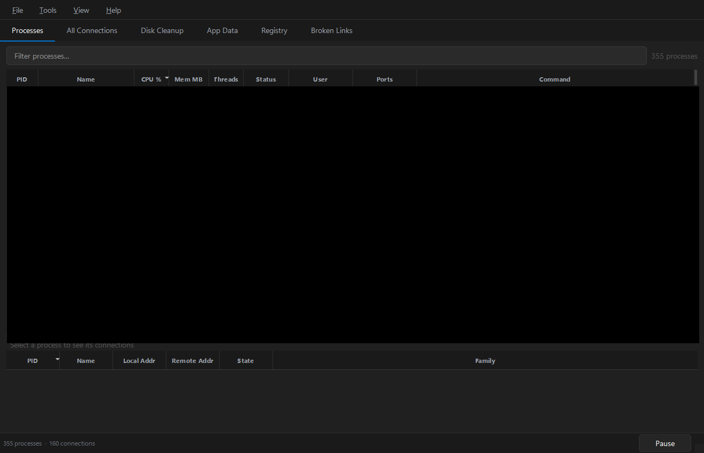
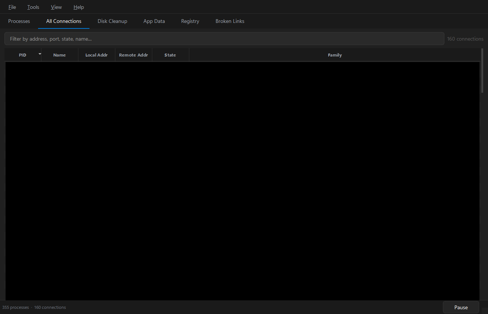
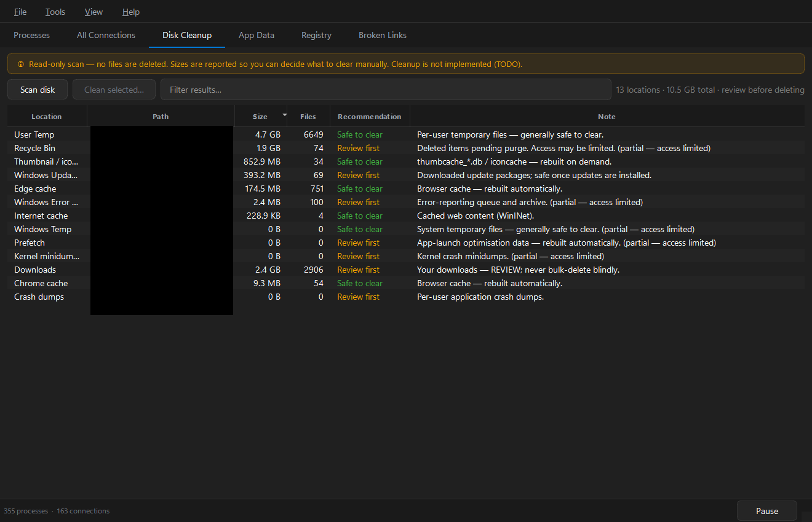
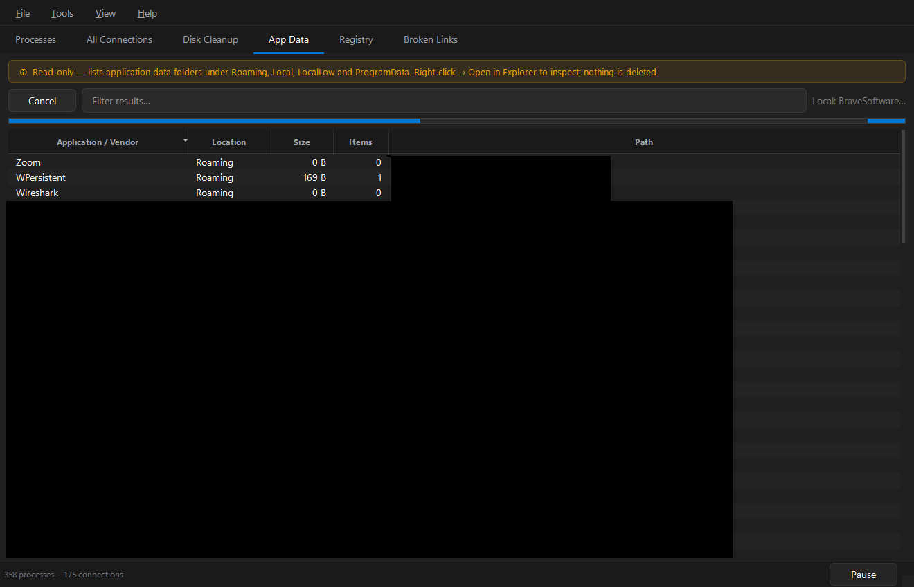
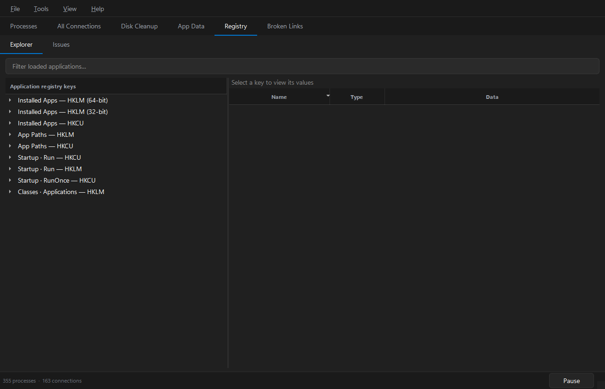
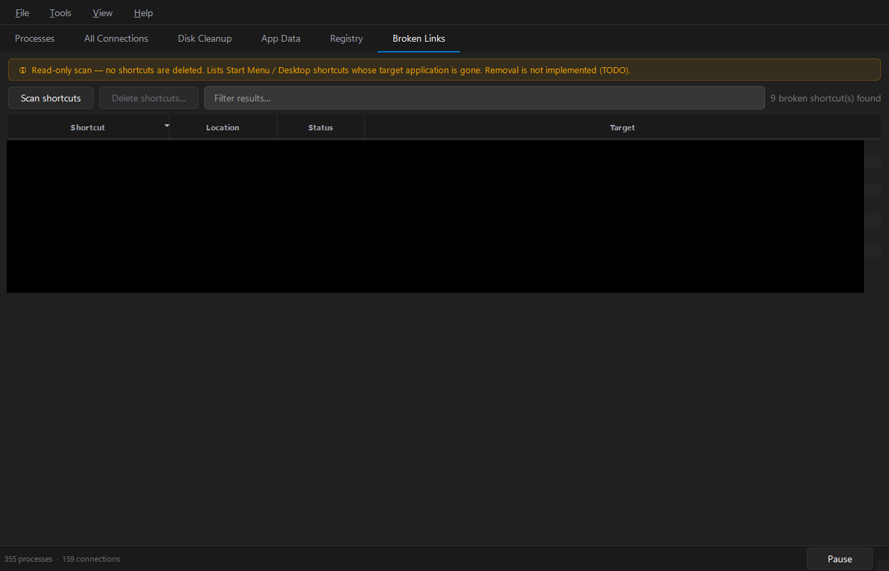
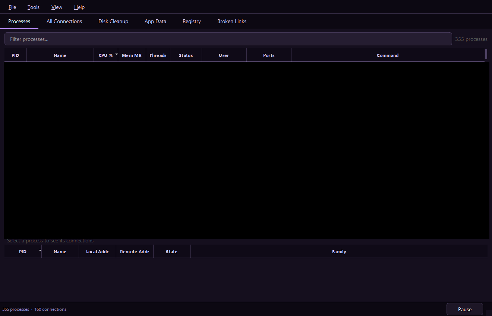
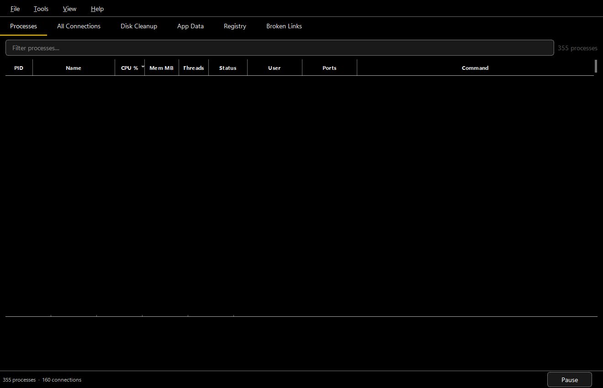

# Qt Task Manager

A fast, modern desktop task manager for Windows, built with **PySide6** and **psutil**.

Live processes and network connections, plus a set of **read-only** system scanners
(disk cleanup, App Data, registry hygiene and broken shortcuts) — all behind a clean,
themeable Fluent-inspired UI.



---

## Features

| Tab | What it does |
| --- | --- |
| **Processes** | Live table — PID, name, CPU %, memory, threads, status, user, listening ports, full command line. Filter across every column, sort, multi-select, kill (single or batch), inspect details, open file location. Per-process connections shown in the panel below. |
| **All Connections** | Live view of every inet connection — local/remote address, state, IPv4/IPv6 — with instant filtering. |
| **Disk Cleanup** | Read-only sizes of dozens of well-known cache/temp locations — Windows temp & shader caches, Windows Update & servicing, crash dumps, every Chromium browser plus Firefox, comms apps (Teams/Discord/Slack/…), and developer caches (pip, npm, uv, Gradle, NuGet, Cargo, Go, …) — each with a *safe to clear* / *review first* recommendation. |
| **App Data** | Browse per-application folders under Roaming, Local, LocalLow and ProgramData, sized and sorted — right-click → Open in Explorer. |
| **Registry** | An **Explorer** for the registry locations where Windows records applications (Uninstall, App Paths, Run/RunOnce, Classes), plus an **Issues** scan that flags entries whose target is gone. |
| **Broken Links** | Start Menu / Desktop shortcuts whose target executable no longer exists. |

> **The scanners never modify or delete anything.** They only report what you may want
> to review and clean up yourself. Removal actions are intentionally disabled (read-only by design).

### Also

- **Live refresh** with pause/resume and a configurable interval (Settings).
- **Three themes** — Dark, High Contrast and Lilac — switchable live from **View › Theme**.
- **Persistent preferences** — theme, refresh interval and window geometry are remembered.
- **Tools › Run all scans** kicks off every scanner at once.

## Screenshots

| All Connections | Disk Cleanup |
| --- | --- |
|  |  |

| App Data | Registry Explorer |
| --- | --- |
|  |  |

| Broken Links | Lilac theme |
| --- | --- |
|  |  |

High Contrast theme:



## Requirements

- **Windows** (the scanners use the registry, AppData roots, the Recycle Bin and `.lnk` shortcuts).
- **Python ≥ 3.14**
- [`uv`](https://docs.astral.sh/uv/) (recommended) for dependency management.

Dependencies: `pyside6 >= 6.7`, `psutil >= 5.9`.

## Run

```powershell
uv sync
uv run python main.py
```

Killing system-owned processes and reading some locations requires elevation —
run from an **administrator** terminal for full access.

## Build a standalone executable

A onefile Windows `.exe` is produced with Nuitka via `pyside6-deploy`:

```powershell
.\build.ps1            # output: dist\QtProcMan.exe
.\build.ps1 -Clean     # remove previous build artifacts first
```

The build syncs the `dev` dependency group (which provides Nuitka), regenerates the
app icon and runs `pyside6-deploy` against `pysidedeploy.spec`.

## How it works

```
Main thread        UI, Qt event loop, model updates
  └─ Worker QThread     blocks on the collector future
       └─ Subprocess        psutil runs here (separate GIL)
  └─ QThreadPool        on-demand scanners (disk / appdata / registry / links)
```

- Process and connection collection runs in a **separate subprocess**
  (`ProcessPoolExecutor`), so psutil's work never touches the main-thread GIL and
  the UI stays responsive even under load.
- A worker `QThread` drives that subprocess on a timer and hands results back to the
  GUI via queued signals.
- Each scanner is a cancellable job on the global `QThreadPool`, reporting progress
  and streaming results back to its tab.

## Project layout

```
main.py              entry point — QApplication + MainWindow
build.ps1            standalone-exe build script (pyside6-deploy)
pysidedeploy.spec    Nuitka / deploy configuration
procman/
  window.py          MainWindow — tabs, menus, worker wiring, kill handling
  collector.py       background QThread driving the collection subprocess
  data.py            pure-psutil collection (no Qt — runs in the subprocess)
  proc_tab.py        Processes tab + per-process connection detail
  port_tab.py        All Connections tab
  scan_tab.py        shared base for the read-only scan tabs
  disk_tab.py / appdata_tab.py / registry_tab.py / links_tab.py
  registry_explorer.py   read-only application-registry browser
  theme.py + styles/app.qss   themeable QSS (Dark / High Contrast / Lilac)
  settings.py + settings_dialog.py   persisted preferences
```

## License

See the repository for license details.

Author: [carneirofc](https://github.com/carneirofc) ·
Repository: <https://github.com/carneirofc/qttaskmanager>
